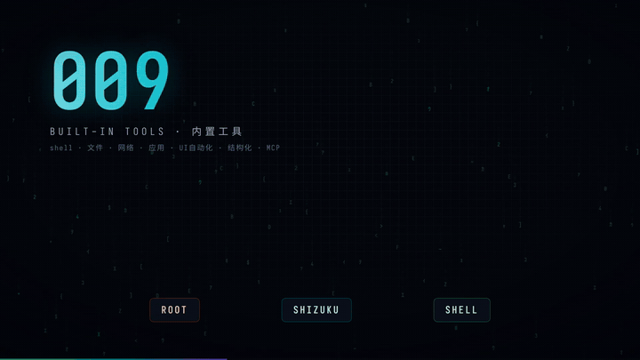

# 🎬 Android Guru Agent 宣传片

> 一支**完全由代码生成**的产品宣传片 —— 无任何拍摄素材，全部画面由 HTML/CSS/JS 确定性动画逐帧渲染，音频由 numpy 算法合成。

- **成片**：[`android-guru-agent-promo.mp4`](./android-guru-agent-promo.mp4)（1920×1080 · 60fps · H.264 · 约 96 秒）
- **GIF 预览**（可直接内嵌到主 README）：



## 内容结构

| 时间轴 | 场景 | 展示内容 |
|--------|------|----------|
| 0:00–0:05 | 开机自检 | GURU-BIOS 冷启动、cs-mem 加载、glitch 标题闪现 |
| 0:05–0:12 | 痛点 | 每天解锁 100+ 次 · 点按→切换→重复 · "依然只是个工具" |
| 0:12–0:20 | 主标题 | 轨道徽标 + ANDROID GURU AGENT + 设备上的大脑/终端/肌肉记忆 |
| 0:20–0:34 | Agent 工作流 | 自然语言指令 → THINK/PLAN/PERCEIVE/ACT/OBSERVE 闭环 + 真实工具调用日志 + 六模式 |
| 0:34–0:47 | 109 工具墙 | 计数器 + 真实工具名瀑布（shell/文件/网络/应用/UI/结构化/MCP）+ 三级权限链 |
| 0:47–0:59 | PRoot Ubuntu | 手机内运行 Ubuntu 24.04 终端（apt install）+ `LinuxPRootBackend.kt` 真实代码 |
| 0:59–1:13 | 仿生记忆 cs-mem | `BypassExecutionEngine.kt` 真实代码 + 感知→降维→蒸馏→FSM→0 token 旁路回放管线 |
| 1:13–1:36 | 数据 & CTA | 18万行/20模块/252测试统计 + GitHub 地址 + 点亮 Star |

## 技术细节（如何做到“代码生成”）

- **确定性渲染**：单一 `stage.html`，所有动画是时间 `t` 的纯函数，`window.seek(t)` 驱动；无 CSS transition / 无随机数漂移
- **5760 帧逐帧截图**：Playwright × 双 Chromium worker，1080p@60fps JPEG 序列
- **合成音频**：100 BPM 电子 BGM（kick/snare/hat/bass/arp/pad 全 numpy 合成）+ whoosh/impact/glitch SFX 精确对齐 7 个场景切换点 + 中文旁白，经**两遍 loudnorm 归一化到 -14 LUFS**（流媒体标准响度）
- **品牌一致性**：配色取自 `docs/assets/banner.svg`（`#3DDC84` 绿 / `#00C2D1` 青 / `#7F52FF` 紫），等宽字体 Sarasa Mono SC
- **真实内容**：工具名、代码片段、架构流程均来自本仓库真实源码（`BypassExecutionEngine.kt`、`LinuxPRootBackend.kt`、`ApexAgentEngine.kt`）

## 在主 README 中引用（可选）

```markdown
<a href="promo/android-guru-agent-promo.mp4">
  
</a>
```
